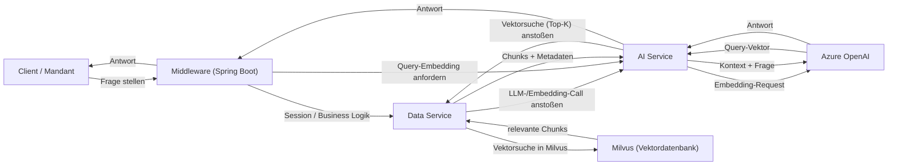
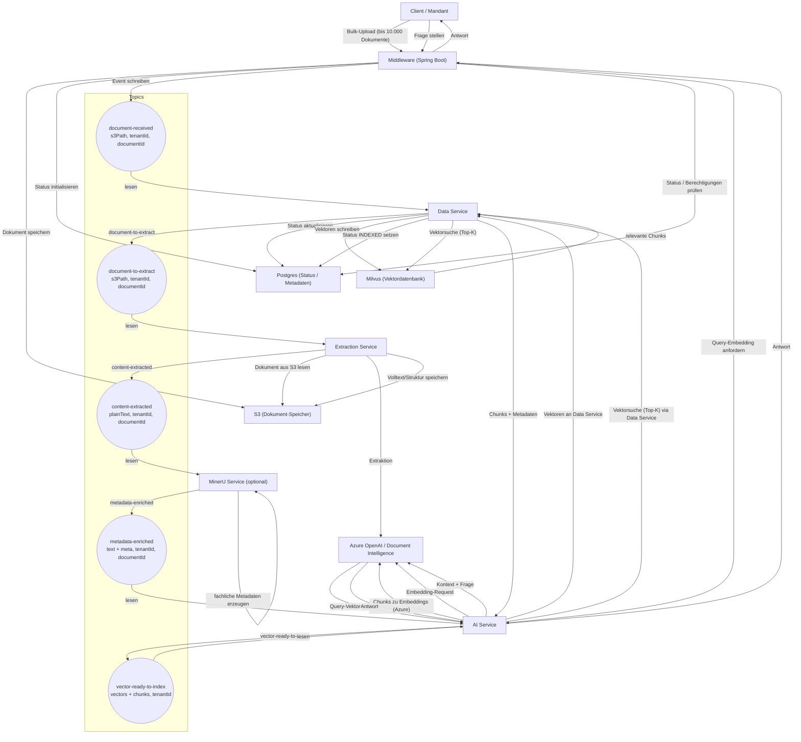
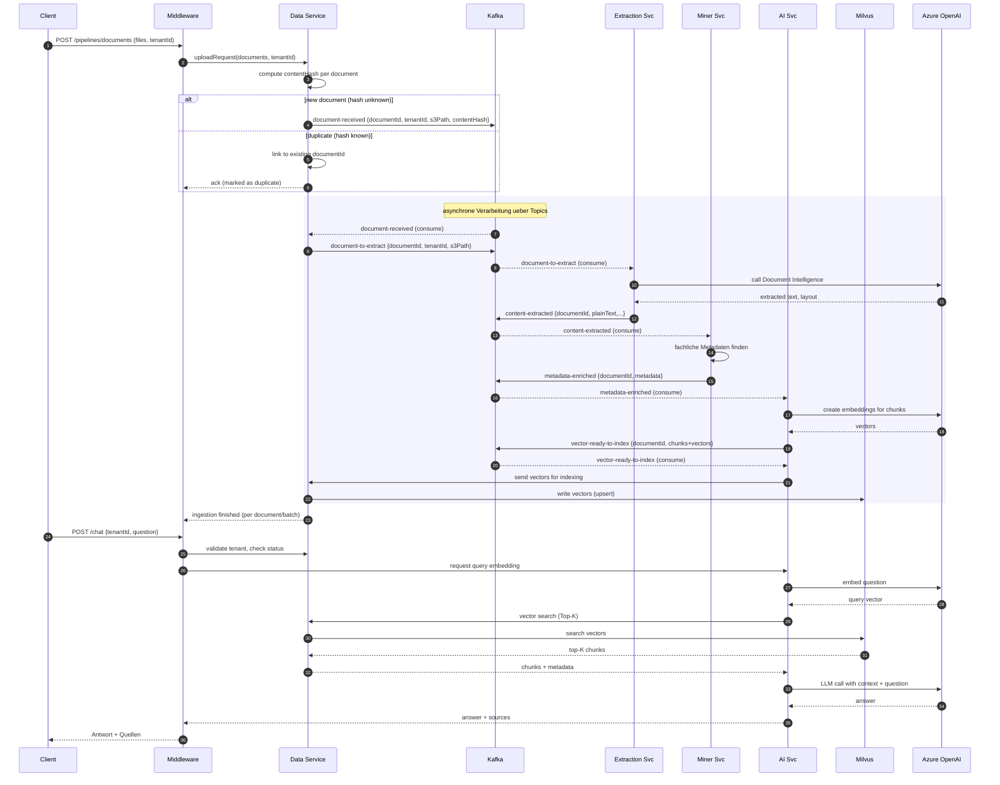
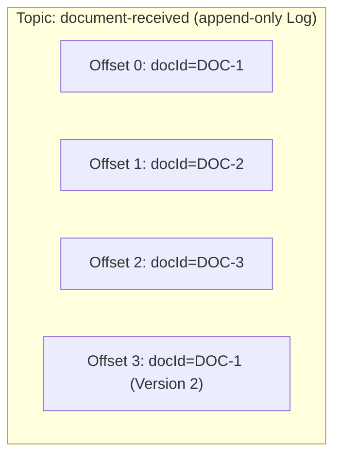
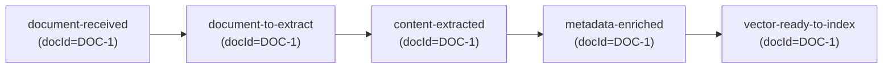
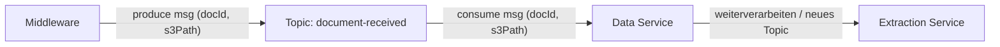
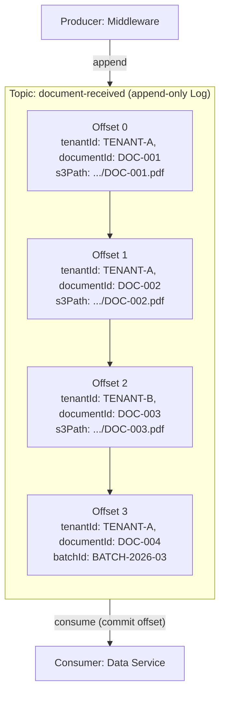
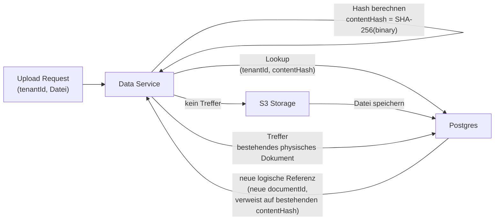
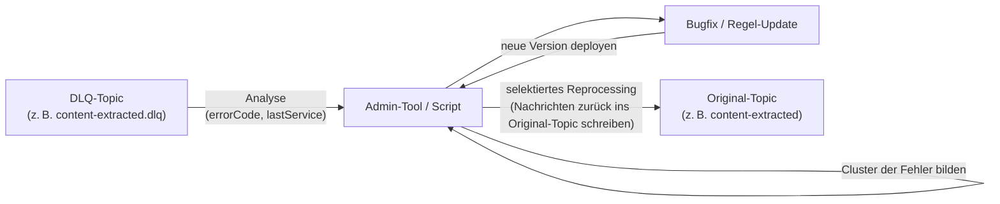

# RAG-Systemarchitektur (Event-Driven)

## Gliederung

- [1. Zielsetzung](#1-zielsetzung)
  - [1.1 Zielgruppe & Lesehinweise](#11-zielgruppe--lesehinweise)
- [2. Service-Landschaft](#2-service-landschaft)
  - [2.1 Externe Abhängigkeiten](#21-externe-abhängigkeiten)
  - [2.2 Schnittstellen & Kontrakte (Überblick)](#22-schnittstellen--kontrakte-überblick)
- [3. Architektur-Diagramme](#3-architektur-diagramme)
  - [3.1 Ingestion / Dokumenten-Pipeline (mit Kafka)](#31-ingestion--dokumenten-pipeline-mit-kafka)
  - [3.2 Inference / Query-Pipeline (ohne Kafka)](#32-inference--query-pipeline-ohne-kafka)
  - [3.3 Gesamtübersicht: End-to-End Flow mit Topics](#33-gesamtübersicht-end-to-end-flow-mit-topics)
  - [3.4 Sequenzdiagramm: Ingestion & Retrieval](#34-sequenzdiagramm-ingestion--retrieval-synchron--asynchron)
  - [3.5 Visualisierung von Topics & Messages](#35-visualisierung-von-topics--messages)
  - [3.5.4 Topic vs. Messages – abgegrenzt](#354-topic-vs-messages--abgegrenzt-szenario-document-received)
- [4. Kafka "Nervensystem" (Topic-Strategie)](#4-kafka-nervensystem-topic-strategie)
  - [4.1 Topic-Übersicht](#41-topic-übersicht)
  - [4.2 Topic-Payloads (Schnittstellen-Kontrakt)](#42-topic-payloads-schnittstellen-kontrakt)
  - [4.3 Beispiel-Events je Topic](#43-beispiel-events-je-topic)
  - [4.4 Producer–Topic–Consumer Mapping](#44-producer-topic-consumer-mapping)
  - [4.5 Architekten-Notiz: JSON vs. Avro (bewusst JSON)](#45-architekten-notiz-json-vs-avro-bewusst-json)
- [5. End-to-End Datenfluss (Pipelines)](#5-end-to-end-datenfluss-pipelines)
  - [5.1 Ingestion Pipeline (Daten-Aufnahme)](#51-ingestion-pipeline-daten-aufnahme)
  - [5.2 Inference Pipeline (Abfrage/Chat)](#52-inference-pipeline-abfragechat)
  - [5.3 Wichtige REST-Endpunkte](#53-wichtige-rest-endpunkte-schnittstellen-kontrakt)
  - [5.4 Beispielszenario: Ingestion & Retrieval End-to-End](#54-beispielszenario-ingestion--retrieval-end-to-end)
  - [5.5 Mandantentrennung & Deduplizierung (`tenantId` & `contentHash`)](#55-mandantentrennung--deduplizierung-tenantid--contenthash)
- [6. Warum dieses Konzept? (Argumentation)](#6-warum-dieses-konzept-argumentation)
- [7. Betrieb, Skalierung & Bottlenecks](#7-betrieb-skalierung--bottlenecks)
  - [7.1 Wie wir Topics verstehen](#71-wie-wir-topics-verstehen)
  - [7.2 Ablauf bei Multi-Upload](#72-ablauf-bei-multi-upload-viele-dokumente-auf-einmal)
  - [7.3 Retry-Mechanismen & Fehlerbehandlung](#73-retry-mechanismen--fehlerbehandlung)
  - [7.4 Typische Bottlenecks pro Stage](#74-typische-bottlenecks-pro-stage)
  - [7.5 Zusammenspiel mit Kubernetes](#75-zusammenspiel-mit-kubernetes)
  - [7.6 Fehlerszenarien & Reprocessing-Strategien](#76-fehlerszenarien--reprocessing-strategien)
- [8. Glossar (wichtige Begriffe)](#8-glossar-wichtige-begriffe)
- [9. Weiterführende Literatur & Referenzen](#9-weiterführende-literatur--referenzen)

---

## 1. Zielsetzung
Dieses Dokument beschreibt die **Architektur unserer RAG-Pipeline** als event-getriebenes, mandantenfähiges System:

- **Dokumenten-Ingestion** (Extraktion, Anreicherung, Embeddings)
- **Wissenssuche** (Vektorsuche & Reranking)
- **Antwortgenerierung** (LLM)

Im Fokus stehen **Services, Topics, Datenflüsse und externe Abhängigkeiten** – also wie das Projekt logisch aufgebaut ist.

## 1.1 Zielgruppe & Lesehinweise
- **Für wen**:
  - **Backend-/Data-Engineers**: Architektur, Services, Payloads (Abschnitte 2–5).
  - **SRE/DevOps**: Betrieb, Skalierung, Bottlenecks (Abschnitt 7).
  - **Produkt/Stakeholder**: High-Level-Überblick, „Warum dieses Konzept?“ (Abschnitt 6).
- **Wie lesen**:
  - Wenn du **neu im Projekt** bist, starte mit Abschnitt 2 und 3.
  - Wenn du **einen Incident** oder Bottleneck analysierst, springe direkt zu Abschnitt 7.
  - Wenn du **Argumente für Architekturentscheidungen** brauchst, lies Abschnitt 6.

---

## 2. Service-Landschaft

| Service                | Sprache     | Hauptaufgabe                                                  |
| ---------------------- | ----------- | ------------------------------------------------------------- |
| **Middleware**         | Spring Boot | API Gateway, Authentifizierung, S3-Management, Proxy-Logik.   |
| **Extraction Service** | Python      | Text-Extraktion aus PDFs, Bildern und Office-Dokumenten.      |
| **MinerU Service (optional)** | Python      | Zukünftige Alternative zum Extraction Service für fachliches Daten-Mining (Entitäten, IDs, Beträge); aktuell noch nicht produktiv im Einsatz. |
| **AI Service**         | Python      | Text-Chunking und Erstellung von Embeddings via Azure OpenAI. |
| **Data Service**       | Python      | Orchestrierung der Datenflüsse und Zustandsüberwachung.       |


### 2.1 Externe Abhängigkeiten

| Service    | Externer Dienst | Zweck                                        |
| ---------- | --------------- | -------------------------------------------- |
| Middleware | S3              | Persistenz der Original-Dokumente            |
| Middleware | Azure OpenAI    | Embeddings & LLM-Inferenz (Abfragepfad)      |
| AI Service | Azure OpenAI    | Embeddings (Ingestionpfad)                   |
| AI Service | Milvus          | Schreiben der Vektoren                       |
| Middleware | Milvus          | Lesen der Vektoren für die Ähnlichkeitssuche |


### 2.2 Schnittstellen & Kontrakte (Überblick)

- **REST-API (Middleware)**: Upload von Dokumenten, Starten von Pipelines, Status-Abfragen, Chat-/Query-Endpunkte.
- **Kafka-Topics**: Asynchrone Übergabe zwischen Services; jedes Topic hat einen klar definierten Payload-Kontrakt.
- **Data Service**: Zentrale Fassade für Milvus (Schreiben/Lesen von Vektoren) und Status-Updates in Postgres.
- **AI Service**: Spricht ausschließlich mit Azure OpenAI und dem Data Service – nie direkt mit Milvus.


---

## 3. Architektur-Diagramme
Um den Ablauf klar zu trennen, zeigen wir zwei Sichten:

- eine **Ingestion-Sicht** mit Kafka-Topics und Python-Services und
- eine **Inference-Sicht** für Queries über Middleware, Azure OpenAI und Milvus.

### 3.1 Ingestion / Dokumenten-Pipeline (mit Kafka)

```mermaid
graph LR
    User["Client / Mandant"]
    API["Middleware (Spring Boot)"]

    subgraph Kafka["Kafka Topics"]
        DR["document-received"]
        DTE["document-to-extract"]
        CE["content-extracted"]
        ME["metadata-enriched"]
        VRTI["vector-ready-to-index"]
    end

    DS["Data Service"]
    ES["Extraction Service"]
    MS["MinerU Service (optional)"]
    AIS["AI Service"]

    S3["S3 (Dokument-Speicher)"]
    MILVUS["Milvus (Vektordatenbank)"]

    User -->|"Upload Dokument(e)"| API
    API -->|"Speichern"| S3
    API -->|"Event: document-received"| DR

    DR -->|"lesen"| DS
    DS -->|"document-to-extract"| DTE

    DTE -->|"lesen"| ES
    ES -->|"content-extracted"| CE

    CE -->|"lesen"| MS
    MS -->|"metadata-enriched"| ME

    ME -->|"lesen"| AIS
    AIS -->|"vector-ready-to-index"| VRTI
    AIS -->|"Vektoren schreiben"| MILVUS
```



### 3.2 Inference / Query-Pipeline (ohne Kafka)



### 3.3 Gesamtübersicht: End-to-End Flow mit Topics

Die runden Knoten unten repräsentieren **Kafka-Topics**.  
In den Labels ist jeweils kurz angedeutet, **welche Payload** darin steckt.



---

### 3.4 Sequenzdiagramm: Ingestion & Retrieval (synchron + asynchron)

Das folgende Sequenzdiagramm stellt den Gesamtfluss noch einmal aus Sicht der **Aufrufe und Events** dar.



### 3.5 Visualisierung von Topics & Messages

#### 3.5.1 Ein Topic als Log (Zeitachse)



#### 3.5.2 Ein Dokument ueber mehrere Topics hinweg



#### 3.5.3 Producer–Topic–Consumer auf einen Blick



#### 3.5.4 Topic vs. Messages – abgegrenzt (Szenario `document-received`)

**Was ist was?** Ein **Topic** ist ein benannter, append-only **Log**; eine **Message** ist ein einzelnes Event (ein JSON-Payload) an einer **Offset**-Position. Jede Message gehört zu genau einem Topic und wird von Producer(s) geschrieben und von Consumer(s) gelesen.



**Abgrenzung im Überblick**

| Begriff | Bedeutung in unserem Szenario |
|--------|-------------------------------|
| **Topic** | Ein **Kanal** (z. B. `document-received`). Enthält alle Messages in Reihenfolge; wird nicht gelöscht, nur angehängt (bis Retention). |
| **Message** | Ein **Event** = ein JSON-Objekt (Payload) mit z. B. `documentId`, `tenantId`, `s3Path`, `contentHash`. Eine Message = ein hochgeladenes Dokument, das zur Extraktion ansteht. |
| **Offset** | Eindeutige **Position** der Message im Topic-Log. Consumer merken sich den letzten gelesenen Offset (commit). |
| **Partition** (optional) | Bei Skalierung kann ein Topic in Partitionen unterteilt werden; z. B. Partition-Key = `tenantId` für Mandantentrennung und paralleles Lesen. |

## 4. Kafka "Nervensystem" (Topic-Strategie)

Die Kommunikation erfolgt über spezialisierte Topics. Jede Nachricht trägt im Header oder Payload die `tenant_id` zur Sicherstellung der Daten-Isolation.

### 4.1 Topic-Übersicht
1. **Topic:** `document-received`
  - **Trigger:** Spring Boot empfängt Datei.
  - **Inhalt:** S3-Link zum Original, Metadaten, Mandanten-ID.
2. **Topic:** `document-to-extract`
  - **Trigger:** Data Service gibt Dokument zur Verarbeitung frei.
  - **Inhalt:** Pfad zur Rohdatei.
3. **Topic:** `content-extracted`
  - **Trigger:** Extraction Service fertig.
  - **Inhalt:** extrahierter Reintext (Raw-Text).
4. **Topic:** `metadata-enriched`
  - **Trigger:** Miner Service hat Fachdaten (z. B. Rechnungsdatum) gefunden.
  - **Inhalt:** Text + strukturierte Zusatzdaten.
5. **Topic:** `vector-ready-to-index`
  - **Trigger:** AI Service hat Text gechunked und in Vektoren umgewandelt.
  - **Inhalt:** Vektor-Arrays, Chunks, finale Metadaten & `tenant_id`.

### 4.2 Topic-Payloads (Schnittstellen-Kontrakt)

Alle Payloads sind JSON-Objekte; Pflichtfelder sind fett markiert.

- **Topic `document-received`**
  - **`documentId`**: eindeutige ID des Dokuments
  - **`tenantId`**: Mandanten-ID
  - **`s3Path`**: Pfad zur Originaldatei in S3
  - `batchId`: optionale Gruppen-ID für Bulk-Uploads
  - `filename`, `mimeType`, `uploadedBy`
  - `contentHash`: Hash des Datei-Inhalts (z. B. SHA-256)

- **Topic `document-to-extract`**
  - **`documentId`**, **`tenantId`**
  - **`s3Path`**
  - `priority`: z. B. „LOW/MEDIUM/HIGH“

- **Topic `content-extracted`**
  - **`documentId`**, **`tenantId`**
  - **`plainText`**: extrahierter Volltext
  - `structure`: optionale Layout-/Tabelleninfos (z. B. von Document Intelligence)
  - `language`, `sourceFileName`

- **Topic `metadata-enriched`**
  - **`documentId`**, **`tenantId`**
  - **`plainText`**
  - **`metadata`**: strukturierte Fachdaten (z. B. Rechnungsnummer, Datum, Beträge)
  - `detectedEntities`: optionale, modellbasierte Extraktionsergebnisse

- **Topic `vector-ready-to-index`**
  - **`documentId`**, **`tenantId`**
  - **`chunks`**: Liste von Chunks mit:
    - **`chunkId`**, **`text`**
    - **`vector`**: Embedding-Vektor
    - `page`, `offset`, `section`, `metadata`
  - `indexName`: logischer Index-/Collection-Name in Milvus

### 4.3 Beispiel-Events je Topic

**`document-received`**

```json
{
  "documentId": "DOC-123",
  "tenantId": "TENANT-A",
  "batchId": "BATCH-2026-03-01-001",
  "s3Path": "s3://bucket/raw/TENANT-A/DOC-123.pdf",
  "filename": "rechnung_123.pdf",
  "mimeType": "application/pdf",
  "uploadedBy": "user@kunde.de",
  "contentHash": "b8a6b4c0...ef"
}
```

**`document-to-extract`**

```json
{
  "documentId": "DOC-123",
  "tenantId": "TENANT-A",
  "s3Path": "s3://bucket/raw/TENANT-A/DOC-123.pdf",
  "priority": "MEDIUM"
}
```

**`content-extracted`**

```json
{
  "documentId": "DOC-123",
  "tenantId": "TENANT-A",
  "plainText": "Rechnung 123\nKunde XY GmbH\nBetrag: 1.234,56 EUR\n...",
  "structure": {
    "pages": 3,
    "hasTables": true
  },
  "language": "de",
  "sourceFileName": "rechnung_123.pdf"
}
```

**`metadata-enriched`**

```json
{
  "documentId": "DOC-123",
  "tenantId": "TENANT-A",
  "plainText": "Rechnung 123\nKunde XY GmbH\nBetrag: 1.234,56 EUR\n...",
  "metadata": {
    "invoiceNumber": "123",
    "invoiceDate": "2026-02-28",
    "amount": 1234.56,
    "currency": "EUR",
    "customerName": "XY GmbH"
  },
  "detectedEntities": [
    { "type": "INVOICE_NUMBER", "value": "123" },
    { "type": "AMOUNT", "value": "1234.56" }
  ]
}
```

**`vector-ready-to-index`**

```json
{
  "documentId": "DOC-123",
  "tenantId": "TENANT-A",
  "indexName": "tenant-a-main",
  "chunks": [
    {
      "chunkId": "DOC-123-0001",
      "text": "Diese Rechnung bezieht sich auf den Vertrag 9876 ...",
      "vector": [0.0123, -0.9987, 0.4532],
      "page": 1,
      "offset": 0,
      "section": "header",
      "metadata": {
        "invoiceNumber": "123",
        "invoiceDate": "2026-02-28"
      }
    }
  ]
}
```

### 4.4 Producer–Topic–Consumer Mapping


| Producer           | Topic                   | Consumer                                            | Zweck                                         |
| ------------------ | ----------------------- | --------------------------------------------------- | --------------------------------------------- |
| Middleware         | `document-received`     | Data Service                                        | Neues Dokument ist hochgeladen                |
| Data Service       | `document-to-extract`   | Extraction Service                                  | Dokument soll in Text extrahiert werden       |
| Extraction Service | `content-extracted`     | MinerU Service (optional)                           | Rohtext liegt zur fachlichen Anreicherung vor (zukünftige Ausbaustufe) |
| MinerU Service (optional) | `metadata-enriched`     | AI Service                                          | Angereicherter Text ist bereit für Embedding  |
| AI Service         | `vector-ready-to-index` | (Indexer / Milvus-Writer, Teil des AI/Data Service) | Vektoren können persistiert werden            |


### 4.5 Architekten-Notiz: JSON vs. Avro (bewusst JSON)

**Kurz-Zusammenfassung:**  
Alle Kafka-Payloads nutzen **JSON** – keine Avro-Schemas. Das ist eine bewusste Architekturentscheidung: Lesbarkeit, Debugging und Interoperabilität wiegen derzeit höher als die theoretischen Performance-Vorteile von Avro.

| Kriterium | JSON (gewählt) | Avro (Alternative) |
|-----------|----------------|--------------------|
| **Lesbarkeit** | Menschenlesbar in Kafka-UI, Logs, Admin-Tools | Binär; Schema/Codegen nötig zum Inspizieren |
| **Debugging & Onboarding** | Events sofort verständlich; geringer Einstieg für alle Personas | Höhere Hürde für SRE/Fachseite ohne Avro-Tooling |
| **Interoperabilität** | Universell (REST, Scripte, Metriken); kein Schema Registry nötig | Schema Registry, Codegen, Build-Integration erforderlich |
| **Performance / Effizienz** | Größere Messages, langsameres Parsing bei sehr hohem Durchsatz | Kompakter, schnelleres Parsing – relevant bei Kafka als Engpass |
| **Kontrakt-Sicherheit** | Schemas in Doku (Abschnitt 4.2); weiche Evolution möglich | Strikte Schemas, zentrale Evolution über Schema Registry |

**Warum JSON für diese Pipeline passt**

- Die **Bottlenecks** liegen typischerweise bei **Azure OpenAI**, **Document Intelligence** und **Milvus**, nicht beim JSON-Parsing auf dem Bus.
- **Viele Personas** (Backend, Data, SRE, Fach) müssen Events schnell einordnen können – JSON reduziert Reibung.
- **DLQ-Analyse und Reprocessing** profitieren von lesbaren Payloads ohne zusätzliches Tooling.

**Operational Note**

- Die **Payload-Kontrakte** (Abschnitt 4.2) werden wie **strikte Schemas** gepflegt; Änderungen sind dokumentiert und rückwärtskompatibel zu handhaben.
- Falls Kafka bei stark wachsendem Volumen zum Engpass wird: **Avro + Schema Registry** gezielt für High-Volume-Topics (z. B. `vector-ready-to-index`) evaluieren; optional **hybrid**: JSON an Rändern (REST, Admin), Avro intern für ausgewählte Topics.

---

## 5. End-to-End Datenfluss (Pipelines)

### 5.1 Ingestion Pipeline (Daten-Aufnahme)

1. **Client** lädt Dokument über den **Spring Boot Proxy** hoch.
2. **Spring Boot** speichert Datei in **S3** und schreibt Event in `document-received`.
3. **Extraction Service** zieht Text aus dem Dokument (`document-to-extract` → `content-extracted`).
4. *(Optional)* **MinerU Service** reichert den Text mit zusätzlichen Fachmetadaten an (`metadata-enriched`). Dieser Schritt ist als zukünftige Alternative zum Extraction Service geplant und aktuell noch nicht im Einsatz.
5. **AI Service** erstellt Chunks und ruft **Azure OpenAI** für Embeddings auf.
6. Die fertigen Vektoren werden in **Milvus** indiziert (mit `tenant_id` als Partitions-Key).

### 5.2 Inference Pipeline (Abfrage/Chat)

1. **User** stellt eine Frage via **Spring Boot**.
2. **Spring Boot** wandelt die Frage via **Azure** in einen Vektor um.
3. **Spring Boot** führt eine Ähnlichkeitssuche in **Milvus** aus (Filter: `tenant_id == user_tenant`).
4. Gefundene Fakten werden als Kontext an das **LLM (Azure)** gesendet.
5. Die Antwort wird an den Client zurückgegeben.

### 5.3 Wichtige REST-Endpunkte (Schnittstellen-Kontrakt)

**Upload / Pipeline-Start**

- **`POST /api/v1/pipelines/documents`**
  - **Body (JSON oder multipart + JSON-Metadaten):**
    - `tenantId` (string, Pflicht)
    - `mode` (string, z. B. `"ALL_INCLUSIVE"`)
    - `documents` (Liste) mit:
      - `filename`, `contentType`
      - Binärinhalt oder Referenz (z. B. S3-PreSigned-URL)
  - **Response 202 (Accepted):**
    - `batchId` (string)
    - `acceptedCount` (int)
    - `duplicatesSkipped` (int) – Anzahl Dokumente, deren Inhalt bereits bekannt war

**Pipeline-Status abfragen**

- **`GET /api/v1/pipelines/{batchId}/status`**
  - **Response 200 (JSON):**
    - `batchId`
    - `tenantId`
    - `overallStatus` (z. B. `PENDING`, `RUNNING`, `COMPLETED`, `FAILED`)
    - `documents` (Liste mit pro Dokument: `documentId`, `status`, `errors`, `duplicateOfDocumentId?`)

**Frage stellen (Chat / Retrieval)**

- **`POST /api/v1/chat`**
  - **Body:**
    - `tenantId` (string, Pflicht)
    - `question` (string)
    - `batchId` oder Filterkriterien (optional, um auf bestimmte Dokumentmengen zu beschränken)
  - **Response 200:**
    - `answer` (string)
    - `sources` (Liste von Referenzen auf Chunks/Dokumente)

### 5.4 Beispielszenario: Ingestion & Retrieval End-to-End

Dieses Szenario verbindet die Ingestion- und Inference-Pipeline zu einem realistischen Ablauf aus Sicht eines Mandanten.

1. **Bulk-Upload vom Client (10.000 Dokumente)**  
   - Der Client ruft die Middleware per REST auf (z. B. „ALL INCLUSIVE PIPELINE“) und übergibt bis zu 10.000 Dokumente – entweder als **einzelne Requests** oder als **Batch**.  
   - Für jedes Dokument wird intern eine eigene `document_id` vergeben; optional wird zusätzlich eine gemeinsame `batch_id` geführt.
   - Die Middleware bzw. der Data Service berechnet für jedes Dokument einen **Inhalts-Hash** (z. B. `content_hash = SHA-256(binary)`).

2. **Persistenz in S3 und Postgres durch den Data Service**  
   - Die Middleware fungiert als Proxy und leitet die Uploads an den **Data Service** weiter.  
   - Der Data Service prüft anhand von `content_hash`, ob der **identische Inhalt** für denselben `tenantId` bereits existiert:
     - Falls **neu**: Dokument wird im **S3 Storage** gespeichert, in **Postgres** entsteht ein neuer Eintrag (`document_id`, `tenant_id`, `content_hash`, S3-Pfad, Status „RECEIVED“).  
     - Falls **Duplikat**: Es wird nur eine **weitere logische Referenz** (z. B. neue `document_id` mit Verweis auf bestehendes physisches Dokument) angelegt; teure Verarbeitungsschritte können übersprungen oder wiederverwendet werden.
   - Parallel erzeugt der Data Service Events in Kafka (z. B. `document-received` / `document-to-extract`), wie in Abschnitt 4.1 beschrieben – Duplikate können hier je nach Policy entweder **nicht** mehr in die Pipeline gegeben oder als „Shortcut“ markiert werden (z. B. nur Metadaten aktualisieren).

3. **Status-Transparenz für den Mandanten**  
   - Nach erfolgreichem Upload erhält der Client eine **Pipeline-/Job-ID** (z. B. `batch_id`), unter der alle Dokumente des Uploads verwaltet werden.  
   - Über einen dedizierten Status-Endpoint der Middleware kann der Client den **aktuellen Fortschritt** abfragen (z. B. „20 % extrahiert, 10 % indexiert, 70 % pending“).  
   - Die Statusinformationen stammen aus Postgres, das vom Data Service bei jedem Verarbeitungsschritt aktualisiert wird (z. B. `EXTRACTED`, `EMBEDDED`, `INDEXED`).

4. **Extraktion mit Azure Document Intelligence**  
   - Nachdem ein Dokument im S3 Storage liegt und der entsprechende Kafka-Event verarbeitet wurde, zieht der **Extraction Service** das Dokument aus S3.  
   - Der Extraction Service ruft **Azure Document Intelligence** auf und erhält strukturierten Volltext, Layoutinformationen und ggf. Tabellen.  
   - Nach erfolgreicher Extraktion wird der Status in Postgres aktualisiert (z. B. `EXTRACTED`), und ein Event `content-extracted` wird erzeugt.

5. **Speicherung von Volltext & Chunks**  
   - Aus der Antwort von Azure werden **Volltext und Chunks** erzeugt.  
   - Der Volltext (Extraktionsergebnis) wird erneut in S3 gespeichert (z. B. als Markdown/JSON), referenziert über Postgres.  
   - Die Chunks selbst werden in **Milvus** zunächst als reine Text/Metadaten-Einträge oder in separaten Sammlungen vorbereitet, je nach Implementierung.

6. **Erstellung der Embeddings durch den AI Service**  
   - Der **AI Service** übernimmt die vorbereiteten Chunks (über Kafka-Events wie `metadata-enriched` oder interne Abfragen) und sendet sie an **Azure OpenAI**, um Embeddings zu erzeugen.  
   - Der AI Service sorgt für Rate-Limiting und Batch-Verarbeitung, wie in Abschnitt 7 beschrieben.

7. **Speicherung der Embeddings über den Data Service**  
   - Der AI Service leitet die Embedding-Ergebnisse an den **Data Service** weiter oder schreibt sie direkt in Milvus und meldet den Erfolg an den Data Service.  
   - Der Data Service speichert bzw. ergänzt die Embeddings in **Milvus** an der passenden Stelle (Verknüpfung zu `document_id`, `chunk_id`, `tenant_id`).  
   - In Postgres wird der Status des Dokuments (oder des gesamten Batches) auf `INDEXED` bzw. `COMPLETED` gesetzt.

8. **Retrieval / Abfragephase**  
   - Sobald der Batch fertig indexiert ist, kann der Client über die Middleware **Fragen** stellen.  
   - Die Inference-Pipeline aus Abschnitt 4.2 und das Diagramm 3.2 greifen auf die in Milvus gespeicherten Embeddings und Chunks zu und liefern kontextualisierte Antworten zurück.

### 5.5 Mandantentrennung & Deduplizierung (`tenantId` & `contentHash`)

**Kurz-Zusammenfassung:**  
Dieser Abschnitt beschreibt, wie **Mandantentrennung** über `tenantId` und **Deduplizierung** über `contentHash` in der Pipeline technisch umgesetzt werden.

**Technische Details**

- **Kernidee:**  
  - `tenantId` bestimmt, **in welchen Partitionen/Collections** Daten gespeichert und später abgefragt werden.  
  - `contentHash` (z. B. `SHA-256(binary)`) identifiziert **identische Dokumentinhalte** innerhalb eines Tenants.



**Felder und Verwendung**

| Feld            | Ebene             | Zweck                                                                 |
|-----------------|-------------------|-----------------------------------------------------------------------|
| **`tenantId`**  | Request, Topics, DB, Milvus | Strikte Mandantentrennung über alle Stufen (S3-Pfad, Postgres, Milvus-Collection/Partition). |
| **`contentHash`** | Data Service / Postgres | Erkennen von Duplikaten je `tenantId`; Vermeiden doppelter Ingestion teurer Pipelines. |
| **`documentId`** | Postgres, Topics, Milvus | Eindeutige Identifikation je Dokument (auch bei mehreren logischen Referenzen). |
| **`batchId`**  | Request, Postgres | Logische Gruppierung von Uploads (z. B. Tages-/Monatsläufe eines Mandanten). |

**Operational Note (Monitoring & Fehlerszenarien)**

- **Monitoring-Signale**
  - **Deduplizierungsrate**: Verhältnis `duplicatesSkipped / acceptedCount` pro `tenantId` und `batchId`.  
  - **Anteil neuer `contentHash`-Werte** pro Zeitraum: Hoher Anteil kann auf **neue Dokumenttypen** oder fehlerhafte Hash-Berechnung hinweisen.
- **Typische Fehlerszenarien**
  - **Falsche `tenantId` im Upload** → Dokument landet in falscher Partition / falschem Index; Risiko von Daten-Leaks.  
  - **Fehlerhafte Hash-Berechnung** (z. B. unterschiedliche Normalisierung von Binärdaten) → Duplikate werden nicht erkannt, Ingestion-Kosten steigen.  
  - **Kollisionsrisiko** ist bei SHA-256 praktisch vernachlässigbar, sollte aber in Sicherheits-/Compliance-Diskussionen dokumentiert sein.

---

## 6. Warum dieses Konzept? (Argumentation)

- **Entkopplung:** Wenn der Miner-Service ein Update erhält und kurz offline ist, füllen sich die Kafka-Topics, aber kein Dokument geht verloren.
- **Kostenkontrolle (Azure):** Durch die Pufferung in Kafka verhindern wir, dass zu viele gleichzeitige Anfragen das Rate-Limit von Azure OpenAI sprengen.
- **Audit-Log:** Jedes Kafka-Topic dient als permanentes Log. Wir können jederzeit nachvollziehen, wann ein Dokument welche Verarbeitungsstufe erreicht hat.
- **Proxy-Performance:** Die Middleware (Spring Boot) bleibt extrem leichtgewichtig, da die rechenintensive Arbeit (KI & Extraktion) in die Python-Worker ausgelagert ist.

**Takeaways:**

- **Warum Kafka + Microservices?** Entkopplung, Robustheit und Nachvollziehbarkeit.
- **Warum Azure OpenAI + Milvus?** Trennung von LLM-Inferenz und Vektorspeicher mit klaren Verantwortlichkeiten.
- **Warum mandantenfähig?** Saubere Isolation pro `tenantId` in allen Topics, Datenbanken und Indexen.

**Industrie-Kontext (RAG + Event-Streaming):**  
Eine event-getriebene RAG-Architektur mit Kafka entspricht dem etablierten Muster, **LLMs mit echtzeitnahem, kontextspezifischem Wissen zu versorgen** und so Halluzinationen zu reduzieren. Kafka übernimmt dabei die Rolle des **Datenrückgrats** für Ingestion, Verarbeitung und konsistente Anreicherung – vergleichbar mit dem Ansatz „Real-Time GenAI with RAG using Apache Kafka and Flink“ (siehe [Weiterführende Literatur](#9-weiterführende-literatur--referenzen)).

---

## 7. Betrieb, Skalierung & Bottlenecks

### 7.1 Wie wir Topics verstehen

- **Append-only:** Nachrichten in Kafka-Topics werden **nicht editiert**, sondern nur angehängt.  
- **Abarbeitung:** Ein Dokument gilt in einem Verarbeitungsschritt als „abgearbeitet“, wenn der zuständige Service die Nachricht gelesen und seinen **Offset** committet hat.  
- **Historie:** Über die Retention bleiben Events für Analyse, Debugging und Replays verfügbar.

Damit bildet jedes Topic eine **Verarbeitungsstufe** der Pipeline ab (z. B. „extrahiert“, „angereichert“, „vektorisiert“).

### 7.2 Ablauf bei Multi-Upload (viele Dokumente auf einmal)

1. Der Nutzer lädt **mehrere Dokumente** über die Middleware hoch.  
2. Die Middleware erzeugt **pro Dokument** ein Event in `document-received` (optional mit gemeinsamer `batch_id`).  
3. Der Data Service liest diese Events, speichert die Rohdaten in S3 und erzeugt **pro Dokument** ein Event in `document-to-extract`.  
4. Jeder weitere Schritt (Extraktion, Mining, Embeddings, Index) erzeugt wiederum **ein eigenes Event pro Dokument** in den jeweiligen Topics (`content-extracted`, `metadata-enriched`, `vector-ready-to-index`).  

Durch diese feine Granularität können wir:

- bei Rückständen gezielt **eine Stage** skalieren (z. B. nur Extraction),
- einzelne Dokumente oder Batches **nachverfolgen und reprocessen**.

### 7.3 Retry-Mechanismen & Fehlerbehandlung

Um Robustheit zu gewährleisten, arbeiten alle Services mit einem einheitlichen Retry-Konzept:

- **Technische Fehler (z. B. Netzwerk, 5xx von Azure, temporäre S3-Probleme)**  
  - Jeder Service führt **mehrere Retries mit Exponential Backoff** durch (z. B. 3–5 Versuche mit wachsender Wartezeit).  
  - Während der Retries wird **kein Offset committet**, d. h. die Message bleibt im Topic „offen“.  
  - Nach erfolgreichem Versuch wird der Offset einmalig committet.

- **Fachliche Fehler (z. B. defektes PDF, ungültiges Format, dauerhaftes 4xx)**  
  - Nach einem konfigurierbaren Limit (`maxAttempts`) wird die Message in ein **Error-/DLQ-Topic** verschoben, z. B.:  
    - `document-to-extract.dlq`  
    - `content-extracted.dlq`  
    - `vector-ready-to-index.dlq`  
  - Im DLQ-Topic wird zusätzlich ein `errorCode`, `errorMessage` und ein `lastService`-Feld gespeichert.

- **Idempotenz**  
  - Alle Operationen sind so ausgelegt, dass sie **idempotent** sind (z. B. „Embedding für `documentId + chunkId` existiert bereits“ → Skip / Update).  
  - Dadurch sind erneute Verarbeitungsversuche (Replays) jederzeit gefahrlos möglich – sowohl automatisiert als auch manuell aus DLQ-Topics.

- **Monitoring & Operations**  
  - DLQ-Topics werden per Dashboard überwacht (Anzahl Messages, Fehlercodes).  
  - Über Admin-Tools können Einträge aus DLQs **manuell analysiert, korrigiert oder erneut eingespielt** werden (z. B. nach Fix eines Bugs oder einer Schema-Änderung).

### 7.4 Typische Bottlenecks pro Stage

- **Extraction Service** (`document-to-extract` → `content-extracted`)  
  - CPU/GPU-bound (PDF-Parsing, OCR).  
  - Bottleneck-Signal: steigender Lag im Topic `document-to-extract`, hohe Auslastung der Extraction-Pods.  
  - Maßnahme: mehr Replikas des Extraction Services, Worker-Prozesse begrenzen.

- **MinerU Service (optional)** (`content-extracted` → `metadata-enriched`, geplante Alternative zum Extraction Service)
  - CPU-bound (Regex, NLP, fachliche Regeln).  
  - Bottleneck-Signal: Lag in `content-extracted`.  
  - Maßnahme: Scale-out, ggf. Regeln optimieren/batchen.

- **AI Service / Azure OpenAI** (`metadata-enriched` → `vector-ready-to-index`)  
  - Bottleneck: **Azure-Rate-Limits** (Requests/Minute, Tokens/Minute).  
  - Bottleneck-Signal: viele 429/5xx von Azure, wachsender Lag in `metadata-enriched`.  
  - Maßnahmen:
    - internes **Rate-Limiting** pro Pod (Token-Bucket, Queue),
    - Concurrency pro Pod begrenzen,
    - Scale-out nur bis zu einer Obergrenze, die zu den Azure-Limits passt.

- **Milvus / Indexing** (`vector-ready-to-index`)  
  - Bottleneck: viele Inserts / Index-Operationen.  
  - Bottleneck-Signal: steigende Latenzen beim Schreiben, Lag in `vector-ready-to-index`.  
  - Maßnahmen: Batching von Vektoren, eigener Indexer-Service mit eigener Skalierung.

### 7.5 Zusammenspiel mit Kubernetes

- **Ein Deployment pro Service** (Middleware, Data, Extraction, Miner, AI, Indexer).  
- Alle Instanzen eines Services gehören in **eine Consumer-Gruppe** pro Topic – zusätzliche Pods bedeuten mehr parallele Consumer.  
- **Auto-Scaling nach Kafka-Lag:**
  - Z. B. via KEDA/HPA, die auf „Lag pro Consumer-Gruppe“ schauen (z. B. `lag(document-to-extract, extraction-service-group)`).  
  - So werden genau die Stages hochskaliert, in denen sich Messages stauen.
- **Externe Limits beachten:**  
  - Beim AI Service verhindern interne Limits, dass Kubernetes-Skalierung die **Azure-Rate-Limits** überfährt.  
  - Durch Idempotenz (z. B. pro `doc_id`+`chunk_id`) bleiben Replays und Re-Processing robust.

Damit ist klar dokumentiert, **wie** unsere Topics genutzt werden, **wo** Bottlenecks entstehen können und **wie** wir sie über Kubernetes und Kafka-Lag im Betrieb steuern.

### 7.6 Fehlerszenarien & Reprocessing- Strategien

**Kurz-Zusammenfassung:**
Dieser Abschnitt fasst typische Fehlerszenarien in der RAG-Pipeline zusammen und beschreibt, wie über **Retries**, **DLQs** und **Reprocessing** stabiler Betrieb sichergestellt wird.

**Typische Fehlerszenarien (Auszug)**

| Szenario                              | Ursache (typisch)                               | Signal im Betrieb                                      | Maßnahme / Strategie                            |
|--------------------------------------|-------------------------------------------------|--------------------------------------------------------|-----------------------------------------------|
| **Azure 5xx/429 beim Embedding**     | Azure-Störung, Rate-Limits überschritten        | Viele 5xx/429 im AI-Service, wachsender Lag in `metadata-enriched` | Retries mit Backoff, internes Rate-Limiting, ggf. Pods drosseln statt skalieren. |
| **Defektes PDF / inkompatibles Format** | Kaputte Datei, nicht unterstütztes Format      | Wiederholte Fehler im Extraction Service, Einträge im `document-to-extract.dlq` | Nach X Retries in DLQ verschieben, Datei/Quelle korrigieren, gezieltes Reprocessing. |
| **Fachliche Parsing-Fehler**         | Neue Layouts/Belege, nicht abgedeckte Regeln    | Anstieg von `errorCode` in Miner-DLQs, Fach-Feedback   | Regeln/Modelle anpassen, DLQ-Einträge nach Fix erneut einspielen. |
| **Milvus-Write-Latenzen**            | Hohe Schreiblast, fehlendes Batching            | Latenzspitzen beim Indexing, Lag in `vector-ready-to-index` | Batching erhöhen, eigenen Indexer-Service skalieren. |
| **Fehlerhafte Mandanten-Konfiguration** | Falsche `tenantId`/Partition                   | Dokumente fehlen in erwarteten Antworten, Inkonsistenzen in Audits | Korrektur in Postgres, ggf. Re-Indexing betroffener Dokumente. |

**Reprocessing-Flows (vereinfacht)**



**Operational Note**

- **Monitoring-Perspektive (SRE/DevOps)**
  - DLQ-Größen und -Wachstumsgeschwindigkeit pro Topic und `tenantId`.  
  - Kafka-Lag pro Consumer-Gruppe als Indikator für **Staus** in einzelnen Stages.  
  - Fehlerraten nach Service (Extraction, Miner, AI, Indexer) und nach Fehlertyp (`errorCode`).
- **Best Practices**
  - Reprocessing **immer idempotent** gestalten (z. B. Embeddings pro `documentId + chunkId` überschreibbar).  
  - Replays **batchweise** durchführen und Last auf Azure/Milvus berücksichtigen (Zeitfenster, Rate-Limits).  
  - Bei kritischen Tenants ggf. **separates Maintenance-Fenster** für großvolumige Re-Indexing-Jobs vorsehen.

---

## 8. Glossar (wichtige Begriffe)

- **Middleware**: Spring-Boot-Service als API-Gateway/Proxy; nimmt Requests vom Client entgegen, kümmert sich um Authentifizierung und reicht Aufrufe an die internen Services weiter.
- **Data Service**: Python-Service zur Orchestrierung der Datenflüsse (S3, Postgres, Milvus) und Verwaltung von Dokument‑/Batch-Status.
- **Extraction Service**: Python-Service für die Extraktion von Text und Struktur aus binären Dokumenten (PDF, Bilder, Office) via Azure Document Intelligence.
- **MinerU Service (optional)**: geplanter Python-Service zur fachlichen Anreicherung (z. B. Erkennen von Rechnungsnummern, Beträgen, IDs) auf Basis des extrahierten Textes; dient als zukünftige Alternative zum Extraction Service und ist aktuell noch nicht im Einsatz.
- **AI Service**: Python-Service für Chunking, Embedding-Erzeugung (Azure OpenAI) und LLM-Aufrufe für Antworten.
- **Milvus**: Vektordatenbank für Speicherung und Ähnlichkeitssuche der Embeddings; bildet die Grundlage der Wissenssuche.
- **Kafka Topic**: Append-only Log, in das Services Events schreiben (Producer) und aus dem andere Services lesen (Consumer); bildet jeweils eine Verarbeitungsstufe der Pipeline ab.
- **DLQ (Dead Letter Queue)**: Spezielles Kafka-Topic, in das Nachrichten mit dauerhaften Fehlern verschoben werden; dient zur Analyse und zum manuellen/automatisierten Re-Processing.
- **`tenantId`**: Technische Mandanten-ID; wird in allen Topics, Datenbanken und Indexen mitgeführt, um Daten strikt mandantengetrennt zu halten.
- **`documentId`**: Eindeutige ID eines Dokuments innerhalb eines Tenants; verknüpft Rohdatei, Extraktion, Metadaten, Chunks und Embeddings.
- **`batchId`**: Optionale ID, die mehrere Dokumente eines Bulk-Uploads logisch gruppiert (z. B. ein Tages- oder Monatslauf eines Mandanten).
- **`contentHash`**: Hash-Wert (z. B. SHA‑256) über den Dateiinhalt; dient zur Erkennung von Duplikaten über mehrere Uploads hinweg.
- **Chunk**: Kleinere Texteinheit eines Dokuments (Abschnitt, Absatz etc.), die einzeln eingebettet und in Milvus gespeichert wird.
- **Embedding**: Hochdimensionaler Vektor, der die Bedeutung eines Chunks oder einer Frage für die Vektorsuche repräsentiert.

---

## 9. Weiterführende Literatur & Referenzen

| Quelle | Inhalt / Relevanz |
|--------|-------------------|
| **[Real-Time GenAI with RAG using Apache Kafka and Flink to Prevent Hallucinations](https://www.kai-waehner.de/blog/2024/05/30/real-time-genai-with-rag-using-apache-kafka-and-flink-to-prevent-hallucinations/)** (Kai Waehner, Mai 2024) | Erläutert, warum **RAG + Event-Streaming (Kafka/Flink)** LLMs mit echtzeitnahem, kontextspezifischem Datenzugriff versorgt und so **Halluzinationen reduziert**. Themen: Real-Time Data Ingestion, dynamisches Indexing, Skalierbarkeit, kontextuelle Anreicherung in der RAG-Pipeline; inkl. Lightboard-Video und **Expedia-Case-Study** (conversational chatbot, 60 %+ Self-Service, 40 %+ Kosteneinsparung bei Agenten). Direkt anschlussfähig an unsere Architektur (Kafka als Event-Bus, Mandantenfähigkeit, Ingestion vs. Inference). |

