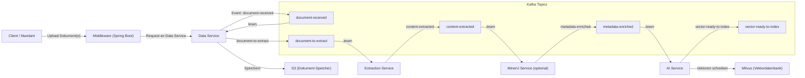
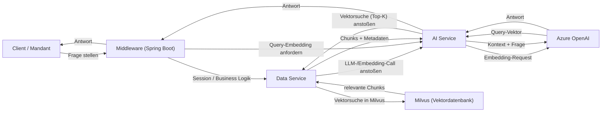
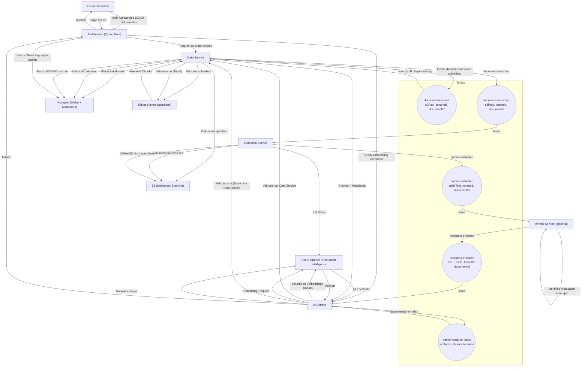

# RAG-Systemarchitektur – Präsentationsauszug

## 1. Zielsetzung

Dieses Dokument beschreibt die **Architektur unserer RAG-Pipeline** als event-getriebenes, mandantenfähiges System:

- **Dokumenten-Ingestion** (Extraktion, Anreicherung, Embeddings)
- **Wissenssuche** (Vektorsuche & Reranking)
- **Antwortgenerierung** (LLM)

Im Fokus stehen **Services, Topics, Datenflüsse und externe Abhängigkeiten** – also wie das Projekt logisch aufgebaut ist.

---

## 2. Service-Landschaft (Überblick)

| Service                | Sprache     | Hauptaufgabe                                                  |
| ---------------------- | ----------- | ------------------------------------------------------------- |
| **Middleware**         | Spring Boot | API Gateway, Authentifizierung, S3-Management, Proxy-Logik.   |
| **Extraction Service** | Python      | Text-Extraktion aus PDFs, Bildern und Office-Dokumenten inkl. Chunking des Volltexts. |
| **MinerU Service (optional)** | Python      | Experimentelles MinerU-Modul für fachliches Daten-Mining (Entitäten, IDs, Beträge); perspektivisch als zusätzliche Funktionalität im Extraction Service vorgesehen, aktuell nicht produktiv im Einsatz. |
| **AI Service**         | Python      | Erstellung von Embeddings via Azure OpenAI auf bereits gechunktem Text. |
| **Data Service**       | Python      | Orchestrierung der Datenflüsse und Zustandsüberwachung.       |

---

## 3. Architektur-Diagramme

Um den Ablauf klar zu trennen, zeigen wir zwei Sichten:

- eine **Ingestion-Sicht** mit Kafka-Topics und Python-Services und
- eine **Inference-Sicht** für Queries über Middleware, Azure OpenAI und Milvus.

### 3.1 Ingestion / Dokumenten-Pipeline (mit Kafka)



### 3.2 Inference / Query-Pipeline (ohne Kafka)



### 3.3 Gesamtübersicht: End-to-End Flow mit Topics

Die runden Knoten unten repräsentieren **Kafka-Topics**.  
In den Labels ist jeweils kurz angedeutet, **welche Payload** darin steckt.

Zur besseren Lesbarkeit können wir den Flow in diese Schritte denken:

1. **Upload & Persistenz** – Client → Middleware → S3/Postgres.  
2. **`document-received`** – Signal „neues Dokument ist im System“.  
3. **Dispatch** – Data Service liest `document-received` und erzeugt `document-to-extract`.  
4. **Extraktion** – Extraction Service erzeugt Volltext (`content-extracted`).  
5. **(Optional) Fachanreicherung** – MinerU Service erzeugt `metadata-enriched`.  
6. **Embeddings & Indexing** – AI Service + Data Service erzeugen `vector-ready-to-index` und schreiben nach Milvus.  
7. **Query / Inference** – Client stellt Frage, Middleware + AI Service holen Kontext aus Milvus und generieren die Antwort.



---

## 4. Kafka-Topics im Detail

### 4.1 Topic-Übersicht

1. **Topic:** `document-received`
  - **Trigger:** Spring Boot empfängt Datei.
  - **Inhalt:** S3-Link zum Original, Metadaten, Mandanten-ID.
2. **Topic:** `document-to-extract`
  - **Trigger:** Data Service gibt Dokument zur Verarbeitung frei.
  - **Inhalt:** Pfad zur Rohdatei.
3. **Topic:** `content-extracted`
  - **Trigger:** Extraction Service fertig.
  - **Inhalt:** extrahierter Reintext (Raw-Text).
4. **Topic:** `metadata-enriched`
  - **Trigger:** Miner Service hat Fachdaten (z. B. Rechnungsdatum) gefunden.
  - **Inhalt:** Text + strukturierte Zusatzdaten.
5. **Topic:** `vector-ready-to-index`
  - **Trigger:** AI Service hat Text gechunked und in Vektoren umgewandelt.
  - **Inhalt:** Vektor-Arrays, Chunks, finale Metadaten & `tenant_id`.

### 4.2 Beispiel-Payloads je Topic (Auszug)

```json
// document-received
{
  "documentId": "DOC-123",
  "tenantId": "TENANT-A",
  "batchId": "BATCH-2026-03-01-001",
  "s3Path": "s3://bucket/raw/TENANT-A/DOC-123.pdf",
  "filename": "rechnung_123.pdf",
  "mimeType": "application/pdf",
  "uploadedBy": "user@kunde.de",
  "contentHash": "b8a6b4c0...ef"
}
```

```json
// document-to-extract
{
  "documentId": "DOC-123",
  "tenantId": "TENANT-A",
  "s3Path": "s3://bucket/raw/TENANT-A/DOC-123.pdf",
  "priority": "MEDIUM"
}
```

```json
// content-extracted
{
  "documentId": "DOC-123",
  "tenantId": "TENANT-A",
  "plainText": "Rechnung 123\nKunde XY GmbH\nBetrag: 1.234,56 EUR\n...",
  "structure": {
    "pages": 3,
    "hasTables": true
  },
  "language": "de",
  "sourceFileName": "rechnung_123.pdf"
}
```

```json
// metadata-enriched
{
  "documentId": "DOC-123",
  "tenantId": "TENANT-A",
  "plainText": "Rechnung 123\nKunde XY GmbH\nBetrag: 1.234,56 EUR\n...",
  "metadata": {
    "invoiceNumber": "123",
    "invoiceDate": "2026-02-28",
    "amount": 1234.56,
    "currency": "EUR",
    "customerName": "XY GmbH"
  }
}
```

```json
// vector-ready-to-index
{
  "documentId": "DOC-123",
  "tenantId": "TENANT-A",
  "indexName": "tenant-a-main",
  "chunks": [
    {
      "chunkId": "DOC-123-0001",
      "text": "Diese Rechnung bezieht sich auf den Vertrag 9876 ...",
      "vector": [0.0123, -0.9987, 0.4532],
      "page": 1,
      "offset": 0,
      "section": "header"
    }
  ]
}
```

---

## 5. End-to-End Datenfluss (Kurzfassung)

### 5.1 Ingestion Pipeline

1. **Client** lädt Dokument über den **Spring Boot Proxy** hoch.
2. **Data Service** speichert Datei in **S3** und legt Status in Postgres an.
3. **Data Service** schreibt Event `document-received`.
4. **Extraction Service** zieht Text aus dem Dokument (`document-to-extract` → `content-extracted`) und erzeugt dabei auch Chunks.
5. *(Optional)* **MinerU Service** reichert den Text mit zusätzlichen Fachmetadaten an (`metadata-enriched`). Dieser Schritt ist aktuell ein MinerU-PoC und soll langfristig als zusätzliche Funktionalität im Extraction Service integriert werden.
6. **AI Service** nutzt die vorbereiteten Chunks und ruft **Azure OpenAI** für Embeddings auf.
7. Die fertigen Vektoren werden in **Milvus** indiziert (mit `tenant_id` als Partitions-Key).

### 5.2 Inference Pipeline

1. **User** stellt eine Frage via **Spring Boot**.
2. **Spring Boot** wandelt die Frage via **Azure** in einen Vektor um.
3. **Spring Boot** führt eine Ähnlichkeitssuche in **Milvus** aus (Filter: `tenant_id == user_tenant`).
4. Gefundene Fakten werden als Kontext an das **LLM (Azure)** gesendet.
5. Die Antwort wird an den Client zurückgegeben.

