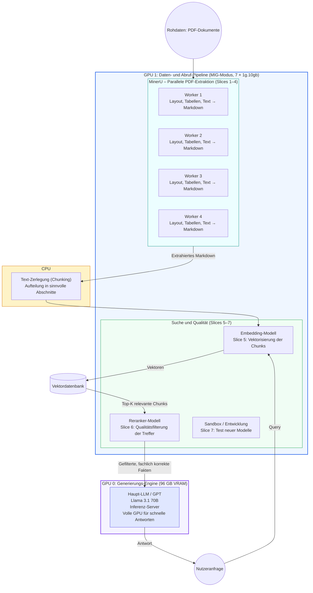

## 1. Zielsetzung

Aufbau einer hochperformanten **RAG-Pipeline** (Retrieval Augmented Generation), die drei Kernaufgaben effizient trennt:

- **Dokumentenextraktion** (MinerU)
- **Wissenssuche** (Embedding & Reranking)
- **Antwortgenerierung** (GPT / LLM)

## 2. Hardware-Konfiguration (NVIDIA MIG)

Um gegenseitige Beeinflussung der Prozesse zu vermeiden, nutzen wir auf der zweiten GPU die **Multi-Instance GPU (MIG)** Technologie von NVIDIA.

### GPU 0: Generation Engine (Full GPU)

- **Modus:** Full GPU (96 GB VRAM)
- **Workload:** Haupt-LLM (z. B. Llama 3.1 70B)
- **Fokus:** Maximale Inferenz-Geschwindigkeit und großer Kontext

### GPU 1: Processing & Retrieval (MIG Mode)

Diese Karte wird in 7 Instanzen des Typs `1g.10gb` partitioniert (je ca. 10–12 GB VRAM):

| Slice  | Dienst              | Aufgabe                                  |
|--------|---------------------|------------------------------------------|
| 1–4    | MinerU Workers      | Parallele PDF-Extraktion                 |
| 5      | Embedding Service   | Vektorisierung der Text-Chunks           |
| 6      | Reranker Service    | Qualitätsfilterung der Suchergebnisse    |
| 7      | Sandbox / Dev       | Test neuer Modelle oder Tools            |

---

## 3. Architektur-Diagramm

Das folgende Mermaid-Diagramm zeigt den Datenfluss von der Roh-PDF bis zur fertigen Antwort:

---

## 4. Prozessbeschreibung

### Phase A: Ingestion (Datenaufnahme)

1. **MinerU:** PDFs werden auf GPU 1 (Slices 1–4) parallel verarbeitet. MinerU extrahiert Layouts, Tabellen und Text in sauberes Markdown.
2. **Vektorisierung:** Der Text wird in Chunks zerlegt, vom Embedding-Modell (Slice 5) in Vektoren übersetzt und in der Vektordatenbank gespeichert.

### Phase B: Retrieval (Suche)

1. Die Nutzeranfrage wird ebenfalls vektorisiert.
2. Die Vektordatenbank liefert relevante Dokumentenabschnitte (Top-K Treffer).
3. Der **Reranker** (Slice 6) bewertet diese Abschnitte neu und filtert nur fachlich korrekte Informationen für das LLM.

### Phase C: Generation (Antwort)

1. Das Haupt-LLM auf GPU 0 erhält die gefilterten Informationen und die Nutzerfrage.
2. Dank der vollen 96 GB VRAM kann das Modell komplexe Zusammenhänge (z. B. Fachwissen) verarbeiten und präzise antworten.

---

## 5. Vorteile des Setups

| Aspekt          | Vorteil                                                                 |
|-----------------|-------------------------------------------------------------------------|
| **Skalierbarkeit** | MinerU verarbeitet bis zu 4 Dokumente gleichzeitig parallel.            |
| **Stabilität**     | Fehler in der PDF-Verarbeitung beeinträchtigen weder Suche noch LLM.   |
| **Performance**    | Das Hauptmodell hat exklusiven Zugriff auf die volle H100 (96 GB VRAM) und profitiert von minimalen Latenzzeiten. |
